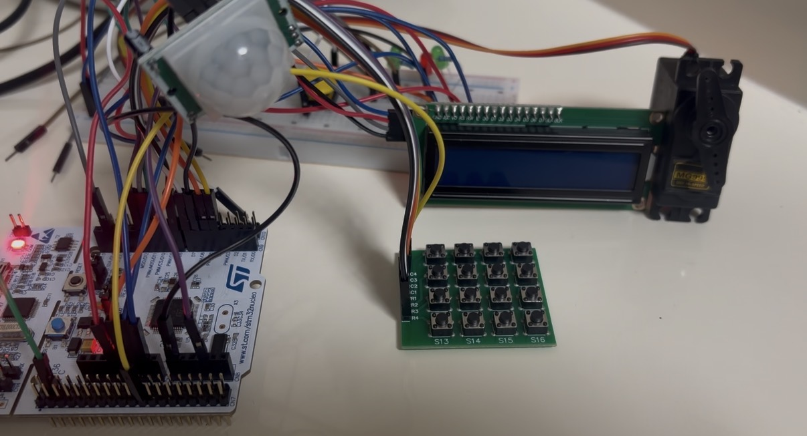
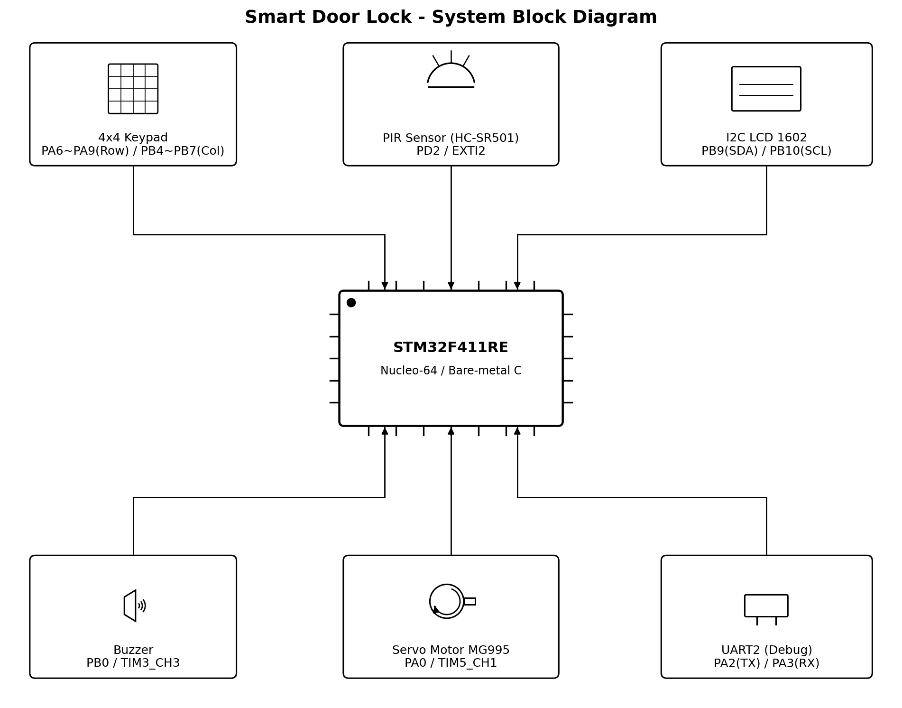
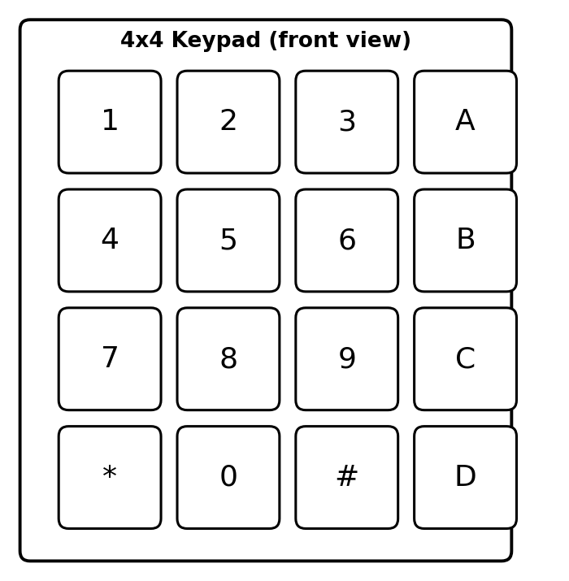
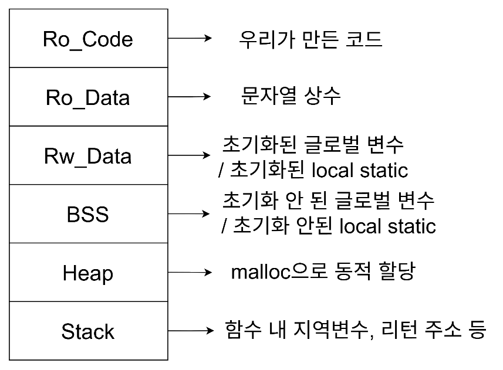

# STM32 Smart Door Lock

STM32F411RE에서 HAL을 사용하지 않고 CMSIS 디바이스 헤더의 레지스터를 직접 제어하여 구현한 PIR·Key Matrix 기반 Smart Door Lock입니다.

GPIO, EXTI, Timer PWM, I2C, UART를 직접 초기화했으며, 링커 스크립트와 Startup Code를 통해 XIP 실행과 .data 복사, .bss 초기화 과정까지 확인했습니다. DMA는 단순히 제외한 것이 아니라 데이터 크기와 전송 빈도를 기준으로 적용 효과를 검토한 뒤 사용하지 않았습니다.

- 개발 기간: 2026.07.23 ~ 2026.07.27
- MCU: STM32F411RE, Arm Cortex-M4
- Board: NUCLEO-F411RE
- Clock: 96 MHz
- 개발 방식: Bare-metal C, HAL 미사용
- Toolchain: GNU Arm Embedded Toolchain, Makefile, STM32CubeProgrammer

## 프로젝트 목표

- CMSIS 구조체를 이용한 Memory-Mapped Register 직접 제어
- PIR 접근 감지와 4x4 Key Matrix 비밀번호 인증 결합
- Timer PWM을 이용한 Servo Motor와 Buzzer 제어
- I2C2와 PCF8574를 이용한 Character LCD 구동
- 상태 기반 입력 처리로 장치 간 동작 통합
- XIP와 Startup Memory 초기화 과정 분석
- DMA 적용 여부를 실제 데이터 흐름 기준으로 판단

## 주요 기능

- PIR 감지 전에는 비밀번호 입력을 받지 않는 대기 상태 유지
- EXTI2 Rising Edge Interrupt로 사용자 접근 감지
- 4x4 Key Matrix의 Row 출력과 Column 입력을 이용한 상태 기반 스캔
- 4자리 비밀번호 입력과 LCD 마스킹 표시
- 올바른 비밀번호 입력 시 Servo Motor 구동과 성공 멜로디 출력
- 잘못된 비밀번호 입력 시 실패음과 재입력 안내
- D 키를 이용한 입력 취소 및 Buffer 초기화
- 로그인 성공 직후에만 # 키를 이용한 비밀번호 변경 허용
- UART2 115200 bps를 이용한 Debug Message 출력

## System Architecture

PIR Sensor는 EXTI Interrupt로 접근 이벤트를 전달하고, Key Matrix는 TIM4 주기 Flag를 기준으로 스캔합니다. 인증 결과에 따라 TIM5 PWM으로 Servo Motor를 제어하고, TIM3 PWM으로 성공음 또는 실패음을 출력합니다. LCD 상태 표시는 I2C2를 통해 PCF8574 Backpack으로 전달됩니다.

### Pin Map

- Key Matrix Row 1 ~ 4: PA6 ~ PA9, GPIO Output
- Key Matrix Column 1 ~ 4: PB4 ~ PB7, GPIO Input과 Internal Pull-down
- PIR Sensor: PD2, EXTI2 Rising Edge
- Servo Motor: PA0, TIM5 Channel 1 PWM
- Buzzer: PB0, TIM3 Channel 3 PWM
- LCD SDA: PB9, I2C2 AF9
- LCD SCL: PB10, I2C2 AF4
- Debug UART TX: PA2, USART2 AF7
- Debug UART RX: PA3, USART2 AF7

## Key Matrix

- 숫자 0 ~ 9: 비밀번호 입력
- 별표 키: 네 자리 입력 후 비밀번호 확인
- D 키: 현재 입력 전체 취소
- # 키: 로그인 성공 직후 비밀번호 변경 Mode 진입
- A, B, C 키: 현재 기본 시나리오에서는 미사용

Key Matrix는 PA6 ~ PA9의 Row를 한 줄씩 HIGH로 출력한 뒤 PB4 ~ PB7의 Column을 읽습니다. 입력 검출 과정은 IDLE, KEY_ISPRESS, SET_ROW, READ_ROW, KEY_RELEASE 상태로 구성했습니다.

SET_ROW와 READ_ROW를 분리하여 Row 출력값이 안정된 다음 주기에 Column을 읽도록 했습니다. 이 방식으로 Delay를 추가하지 않고도 한 번 누른 키가 두 번 인식되는 문제를 해결했습니다.

관련 코드: [keypad.c](firmware/keypad.c)

## 동작 흐름

1. Clock, UART, GPIO, Key Matrix, Timer, Motor, PIR, LCD를 초기화합니다.
2. PIR가 사람을 감지하면 EXTI2 Handler가 pir_detected Flag를 설정합니다.
3. LCD에 Enter Password를 표시하고 Key Matrix 입력을 활성화합니다.
4. 입력한 문자는 LCD와 UART에 별표로 표시됩니다.
5. 네 자리 입력 후 별표 키를 누르면 저장된 비밀번호와 비교합니다.
6. 비밀번호가 일치하면 문을 열고 닫은 뒤 성공 멜로디를 출력합니다.
7. 인증 성공 직후 # 키를 누르면 새 비밀번호 네 자리를 입력할 수 있습니다.
8. 비밀번호가 일치하지 않으면 Try Again을 표시하고 대기 상태로 돌아갑니다.

초기 비밀번호는 1234입니다. 변경한 비밀번호는 실행 중 RAM에만 저장되므로 Reset 후에는 다시 초기 비밀번호가 적용됩니다.

관련 코드: [project.c](firmware/project.c)

## CMSIS Register-Level Control

STM32 HAL API를 호출하지 않고 stm32f411xe.h에 정의된 주변장치 구조체와 Register Field를 직접 사용했습니다.

- RCC: GPIO, SYSCFG, Timer, I2C, UART Clock Enable과 PLL 설정
- GPIO: MODER, PUPDR, OTYPER, OSPEEDR, AFR, IDR, ODR 제어
- EXTI와 SYSCFG: PD2를 EXTI2에 연결하고 Rising Edge Interrupt 설정
- TIM3: Buzzer 주파수와 Duty를 위한 PWM 생성
- TIM4: Key Matrix 스캔 주기 Flag 생성
- TIM5: 20 ms 주기의 Servo Motor PWM 생성
- I2C2: START, Address, TxE, BTF, STOP 상태를 확인하며 LCD Data 전송
- USART2: 115200 bps Debug Message 송수신 설정

CMSIS의 volatile 기반 Register 정의를 사용하여 컴파일러 최적화 과정에서도 Hardware Register 접근이 유지되도록 했습니다.

주요 Driver:

- [pir.c](firmware/pir.c): PD2와 EXTI2 설정
- [motor.c](firmware/motor.c): Servo Motor 구동 방향과 동작 시간 제어
- [timer.c](firmware/timer.c): TIM2 Delay, TIM3 Buzzer, TIM4 Scan Tick, TIM5 Servo PWM
- [i2c.c](firmware/i2c.c): I2C2와 PCF8574 LCD 전송
- [uart.c](firmware/uart.c): USART2 Debug Interface
- [exception.c](firmware/exception.c): EXTI2와 TIM4 Interrupt Handler
- [clock.c](firmware/clock.c): 96 MHz System Clock 설정

## XIP와 Startup Memory 초기화

프로그램은 Internal Flash의 0x0800_0000에서 직접 실행되는 XIP 구조로 구성했습니다. 제공된 Build 결과의 ELF Entry Point도 0x0800_0000으로 확인했습니다.

- .text: Flash에 배치하고 Flash에서 직접 실행
- .rodata: Flash에서 Read Only Data로 사용
- .data: 초기값은 Flash에 저장하고 Startup 과정에서 RAM으로 복사
- .bss: RAM 영역을 Startup 과정에서 0으로 초기화
- Heap과 Stack: RAM 사용

rom_0x08000000.lds는 Flash 512 KiB와 RAM 128 KiB의 배치를 정의합니다. crt0.s의 __start는 Vector Table 이후 .data Copy와 .bss Clear를 수행하고 Main으로 진입합니다.

- [crt0.s](firmware/crt0.s): Vector Table, Reset Entry, .data Copy, .bss Clear
- [rom_0x08000000.lds](firmware/rom_0x08000000.lds): Flash와 RAM Section 배치

## DMA 적용 검토

STM32F411RE의 DMA는 Memory-to-Memory, Peripheral-to-Memory, Memory-to-Peripheral 전송에서 CPU 개입을 줄일 수 있습니다. 하지만 이 프로젝트에는 DMA를 적용하지 않았습니다.

- LCD는 상태가 변경될 때만 소량의 Data를 전송합니다.
- Key Matrix는 연속 Data 전송보다 Row 선택과 Column 판정 순서가 중요한 제어 로직입니다.
- PIR는 EXTI Event만 전달하므로 대용량 Data 이동이 없습니다.
- 현재 구조에서는 DMA 설정과 Interrupt 관리 비용에 비해 CPU Offload 효과가 작습니다.

향후 Sensor Data를 일정 주기로 연속 수집하거나 UART·I2C 전송량이 증가하면 DMA Stream 적용을 검토할 수 있습니다.

## Timer와 출력 장치 제어

### Servo Motor

TIM5 Channel 1에서 20 ms 주기의 PWM을 생성합니다. 사용한 MG995는 연속 회전형이므로 절대 각도 제어 대신 PWM 값으로 회전 방향을 선택하고, TIM2 Delay로 동작 시간을 제한한 뒤 정지시킵니다.

- Open 방향 동작: PWM Value 180
- 정지: PWM Value 90
- Close 방향 동작: PWM Value 0

### Buzzer

TIM3 Channel 3의 ARR과 CCR3를 음계 주파수에 맞게 변경합니다. 인증 성공과 실패에 서로 다른 음계 배열을 적용했습니다.

### I2C LCD

I2C2로 PCF8574의 7-bit Address 0x27에 Data를 전송합니다. 한 Byte를 상위·하위 Nibble로 나누고 EN Signal을 HIGH에서 LOW로 전환하여 LCD에 Latch합니다. LCD는 매 Loop가 아니라 상태가 바뀌는 시점에만 갱신하여 불필요한 Polling 대기를 줄였습니다.

## Troubleshooting

### 한 번 누른 키가 두 번 인식되는 문제

- 현상: Row 출력 직후 Column을 읽으면서 이전 값과 변경된 값이 연속 검출됨
- 원인: GPIO 출력 변경 후 입력이 안정되기 전에 같은 실행 흐름에서 값을 확인
- 초기 시도: TIM2 Delay를 추가해 Read Timing 지연
- 문제점: Blocking Delay 동안 PIR와 다른 입력 처리가 중단됨
- 해결: SET_ROW와 READ_ROW를 별도 상태로 분리하여 다음 Scan Tick에 입력 확인

### State 값이 덮어써지는 문제

- 현상: 특정 Row에서 키를 검출해 KEY_RELEASE로 이동해도 이후 대입문이 다음 Scan 상태로 다시 변경
- 원인: Key 검출 여부와 관계없이 다음 상태를 지정하는 코드가 실행됨
- 해결: Row Flag를 조건으로 다음 Row Scan 또는 KEY_RELEASE를 선택하도록 전이 조건 명시

두 문제를 통해 Delay로 Timing을 맞추기보다 입력 안정화 구간과 State Transition 조건을 분리하는 방식이 전체 시스템의 응답성을 유지하는 데 적합하다는 점을 확인했습니다.

## Test Result

다음 시나리오를 실제 Hardware에서 확인했습니다.

- PIR 감지 시 Key Matrix 활성화: PASS
- 올바른 비밀번호 입력과 Servo Motor 구동: PASS
- 잘못된 비밀번호 입력과 실패음 출력: PASS
- LCD의 Enter Password, Open, Close, Try Again 표시: PASS
- D 키를 이용한 입력 취소: PASS
- 로그인 성공 직후 비밀번호 변경: PASS
- PIR 미감지 상태에서 Key Matrix 입력 무시: PASS
- Key 중복 인식 문제 수정 후 정상 입력: PASS

## Repository Structure

- firmware/project.c: Smart Door Lock Application과 인증 흐름
- firmware/keypad.c: 4x4 Key Matrix State Machine
- firmware/pir.c: PIR GPIO와 EXTI2 설정
- firmware/motor.c: Servo Motor 제어
- firmware/i2c.c: I2C LCD Driver
- firmware/timer.c: Delay와 PWM, 주기 Interrupt
- firmware/exception.c: Interrupt Handler
- firmware/crt0.s: Vector Table과 Startup Code
- firmware/rom_0x08000000.lds: Linker Script
- firmware/stm32f411xe.h: STM32F411RE CMSIS Device Header
- firmware/core_cm4.h: Cortex-M4 CMSIS Core Header
- firmware/Makefile: Build와 Flash 명령
- docs/images: System Block Diagram, Keypad Layout, Memory Layout, Hardware Photo

## Build and Flash

1. GNU Arm Embedded Toolchain을 설치합니다.
2. firmware/Makefile의 TOOL_DIR과 VERSION을 설치 경로에 맞게 수정합니다.
3. firmware 폴더에서 make를 실행하여 ELF와 BIN을 생성합니다.
4. NUCLEO-F411RE를 SWD로 연결합니다.
5. STM32CubeProgrammer CLI가 실행 경로에 등록된 상태에서 make run을 실행합니다.
6. UART Terminal을 115200 bps로 열어 Debug Message를 확인합니다.

Makefile은 Arm Cortex-M4, Thumb, FPv4-SP-D16, Hard-Float 옵션을 사용합니다. Build Output과 Object File은 저장소에 포함하지 않습니다.

## 개선 방향

- 비밀번호를 Internal Flash에 저장하여 Reset 이후에도 유지
- 비밀번호 연속 오류 횟수 제한과 일정 시간 입력 잠금
- 다중 사용자별 비밀번호 관리
- Bluetooth 또는 Wi-Fi를 이용한 원격 상태 확인
- LCD 미사용 시간 기준 Backlight 절전
- 연속 Sensor 또는 통신 Data 처리를 위한 DMA 적용

